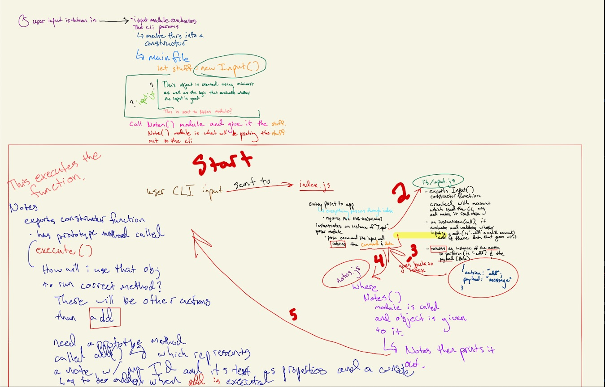
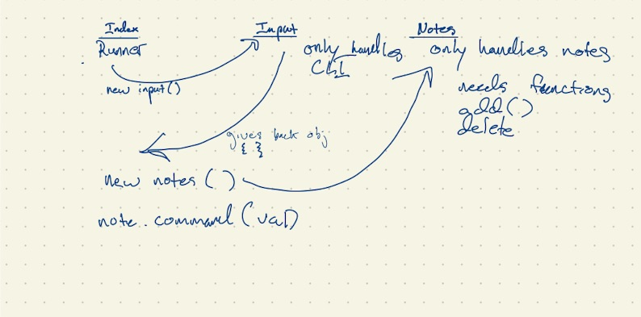

# LAB - Class 03

## Project: Notesy

### Author: Chris Bortel

### Links and Resources
- [class-01 submission PR](https://github.com/Chris-Bortel-401-advanced-javascript/notes/pull/1)
- [class-02 submission PR](https://github.com/Chris-Bortel-401-advanced-javascript/notes/pull/2)
- [class-03 submission PR](https://github.com/Chris-Bortel-401-advanced-javascript/notes/pull/4)
- [ci/cd](http://xyz.com) (GitHub Actions)

### Setup
``npm install``

#### `.env` requirements (where applicable)
i.e.

- `PORT` - Port Number
- `MONGODB_URI` - URL to the running mongo instance/db

#### How to initialize/run your application (where applicable)

- e.g. `npm start`

#### How to use your library (where applicable)

#### Tests

``input.js.test`` type the command ``npm test``
- ```input.js.test``` is working
- Any tests of note?
- Describe any tests that you did not complete, skipped, etc

#### UML






Worked with Kory Jackson 
Utilized switch documentation from [Mozilla web docs](https://developer.mozilla.org/en-US/docs/Web/JavaScript/Reference/Statements/switch)

Cait Rowland helped me refactor my validate function and pass the data through the execute function in order to get my add() function to cooperate.


<!-- # Lab Submission Instructions: Standard Node.js Applications

## Before You Begin

Refer to the [Common Lab Submission Guide](README.md) for general guidelines and instructions common to all lab submissions

### Deployment

Depending on the lab, you may be building a command line application or just a library. In either case ...

- Assume other developers will be downloading and using your app or library from your GitHub Repository
- Pay special attention to the developer centric parts of your README
  - How do I install the app or library?
  - How do I test the app or library?
  - For Applications:
    - How do I run the app?
    - How do I set up the app?
- **Stretch Goal: Publish your App or Library to NPM**
  - Libraries: This would allow anyone to do an `npm install` of your library
  - Apps: This would allow a user to do an `npm install -g` of your application and run it from their command line
    - This requires a new `bin` section in your `package.json`

### Testing

- Write a complete set of tests for all functional units and modules
- Your tests must be running green on Github Actions

### Documentation

#### Compose a UML or Process/Data Flow Diagram for every application

 [UML Reference](https://www.uml-diagrams.org/index-examples.html)

- This should be the first thing you do when beginning work on a lab assignment.
- Draw the process/data flow of your application and map it to the code you will need to write or evaluate/fix.

#### JSDoc

[Official Documentation](http://usejsdoc.org/about-getting-started.html) | [Cheat Sheet](https://devhints.io/jsdoc) | [Style Guide](https://github.com/shri/JSDoc-Style-Guide)

- Write proper jsDoc for every function, module, and class.
  - Be descriptive about the functions' purpose
  - Declare data types for params and return values -->
